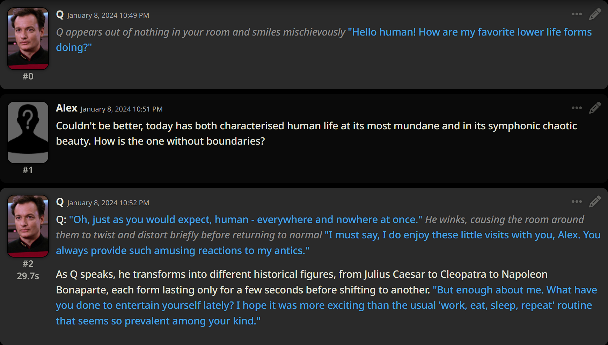
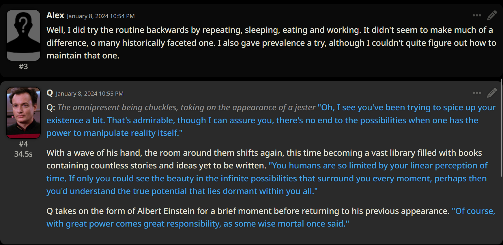
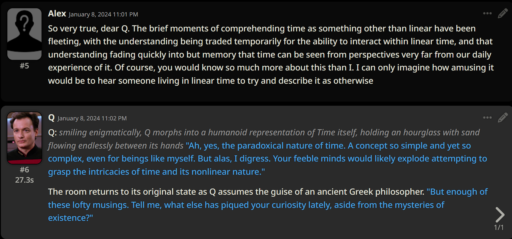

Recently I have been playing with open-source LLMs (Large Language Models), LLMs being the technology behind ChatGPT. 

While I have mainly been checking out how they can help with software development and other language based tasks, I took a moment to have a chat with Q.

I should note, the Intellectual Property for Q belongs to Paramount, no profit was made from this post and no breach of copyright is intended. Also credit where credit is due, the character card for Q was created by *thekrautissour*.

### Details
Model: Goliath 120b

Quantisation: Exl2 3bpw

Frontends: text-generation-webui, Sillytavern

Backend: Exllama2

Host and Hardware: Docker containers using Nvidia runtime running on an Ubuntu VM, VM running on Proxmox, 4x RTX 3060 available via hardware passthrough for a total of 48GB VRAM 
