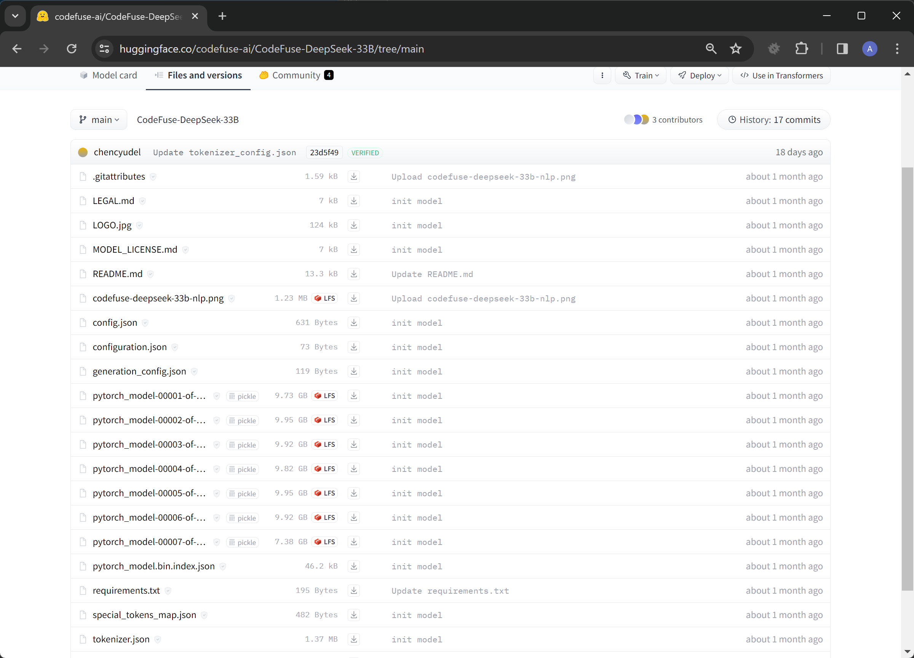
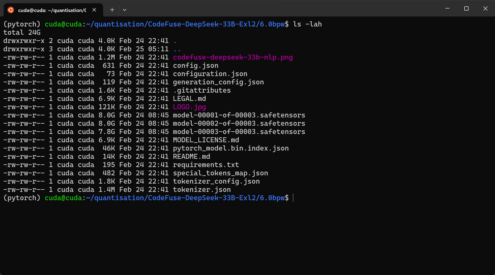
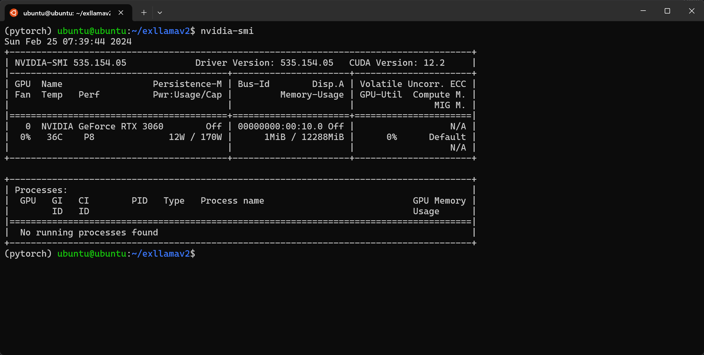
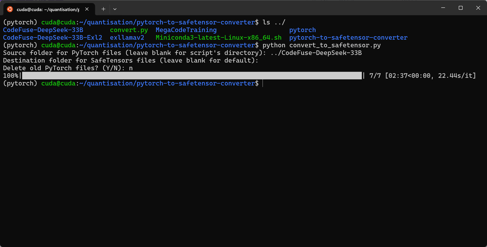
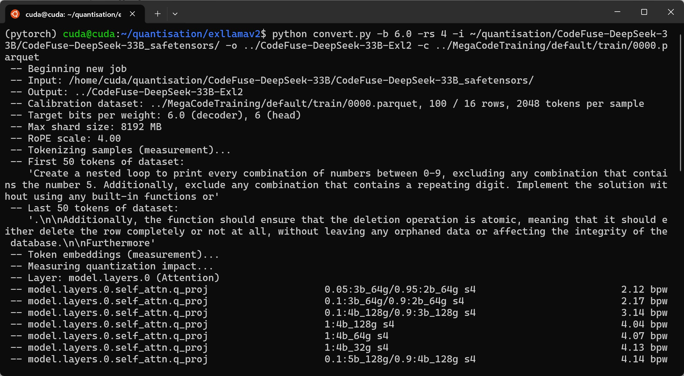
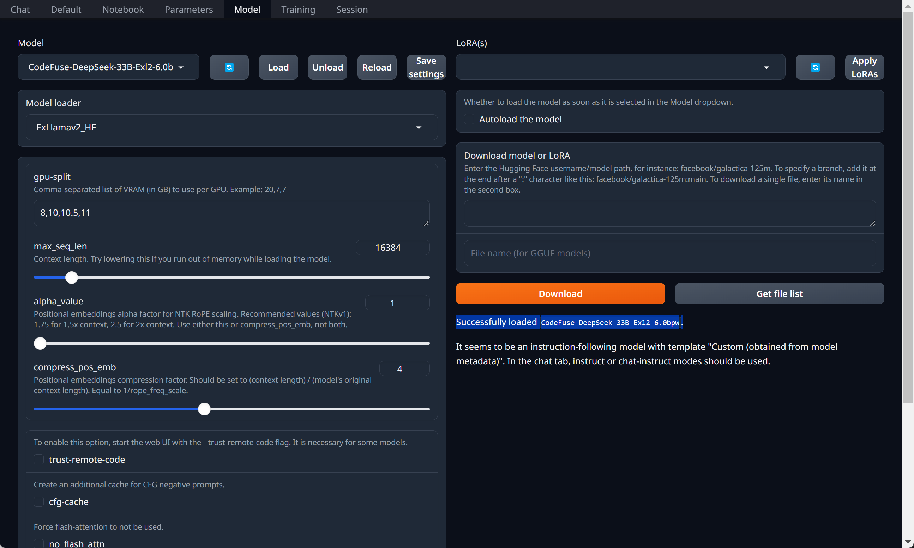
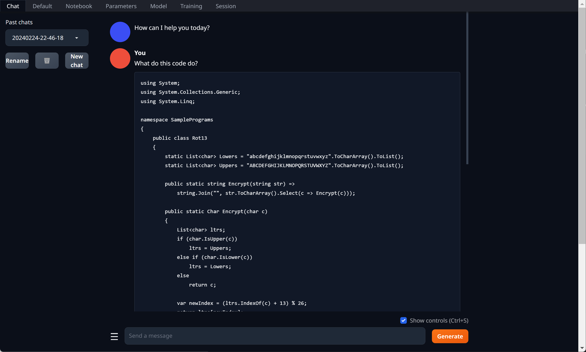
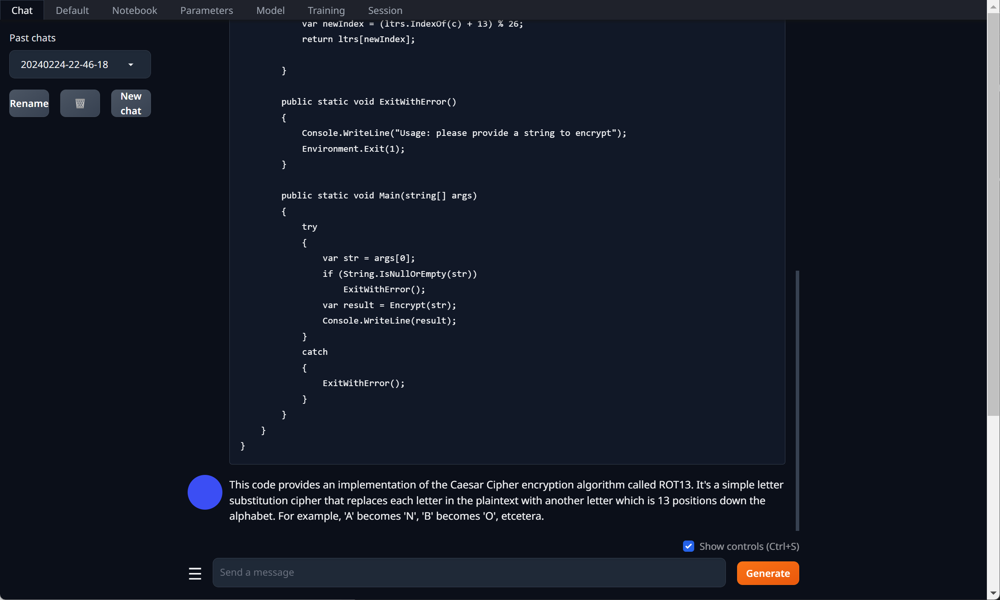

A set of notes on converting a transformers model from Pytorch format to Safetensors format and then quantising to ExLlamaV2 (Exl2) using a code based calibration dataset.

This was inspired by posts which reported coding LLMs quantised to Exl2 format using the `wikitext` default calibration dataset resulted in relatively lower quality outcomes.

[ExLlamaV2 is the excellent work of Turboderp](https://github.com/turboderp/exllamav2). It is an inference library for running LLMs on consumer GPUs. It is fast and supports multi-GPU hosts. There some trade-off between increased speed and loss of quality.

In the example we are converting [codefuse-ai/CodeFuse-DeepSeek-33B](https://huggingface.co/codefuse-ai/CodeFuse-DeepSeek-33B) to Exl2 6bpw (bits per weight).

I am yet to play with this model. It is a finetune of [deepseek-coder-33b-instruct](https://huggingface.co/deepseek-ai/deepseek-coder-33b-instruct) which a good open-source coding model with a license allowing commercial usage.

The conversion process took just under 3 hours. It was successful using a single RTX 3060 with 12GB VRAM, and approximately 64GB RAM.

## Before


## After


## Techstack
* **Ubuntu Linux** 22.04
* **Conda**
* **Pytorch**
* **Nvidia CUDA Toolkit**
* **ExLlamaV2**

## Bring Your Own
* **Host with Ubuntu**
* **Nvidia GPU**
    * 12GB VRAM did the job for a 33 billion parameter model
* **64GB available RAM**
* **100GB+ available disk space**
* **Software for Testing the Quantised Model** (e.g. Text generation web UI, KoboldAI-Client, etc.)

### Install Nvidia Drivers
This step is relevant to those who have an Nvidia GPU and don't have the drivers installed.
```bash
curl -fsSL https://nvidia.github.io/libnvidia-container/gpgkey | sudo gpg --dearmor -o /usr/share/keyrings/nvidia-container-toolkit-keyring.gpg   && curl -s -L https://nvidia.github.io/libnvidia-container/stable/deb/nvidia-container-toolkit.list |     sed 's#deb https://#deb [signed-by=/usr/share/keyrings/nvidia-container-toolkit-keyring.gpg] https://#g' | sudo tee /etc/apt/sources.list.d/nvidia-container-toolkit.list
sudo apt-get update
sudo apt-get install -y nvidia-container-toolkit nvidia-headless-535 nvidia-utils-535-server
sudo reboot #Reboot required for driver to load
```
`nvidia-container-toolkit` is not strictly needed for the process outlined. It is pretty handy for related workloads like running LLMs, their APIs and user interfaces in containers.

This driver setup is for hosts that won't be using X Windows or otherwise need the GPU to display to a monitor connected to the host. This is what the `headless` refers to.

We can confirm successful installation with the `nvidia-smi` command:


### Install Conda
```bash
mkdir ~/quantisation
cd ~/quantisation
curl https://repo.anaconda.com/miniconda/Miniconda3-latest-Linux-x86_64.sh -O
chmod +x Miniconda3-latest-Linux-x86_64.sh
./Miniconda3-latest-Linux-x86_64.sh #Accept the license, and yes to the shell integration 
```
We use Conda to manage Python environments. It makes handling dependencies easier when using multiple Python projects.

We have created a `quantisation` directory in the users home directory to keep all the working files.

### Create a Virtual Environment using Conda
```bash
conda create -n pytorch python=3.11 -y
conda activate pytorch
```
This creates a Virtual Environment called `pytorch` for all required Python libraries.

### Install Hugging Face Hub Package 
```bash
conda install huggingface_hub
```
This package includes `huggingface-cli` which allows easy access to files on Hugging Face.

### Download the Model
```bash
huggingface-cli download codefuse-ai/CodeFuse-DeepSeek-33B --local-dir ~/quantisation/CodeFuse-DeepSeek-33B
```

### Convert Model in Pytorch Format to Safetensors Format
```bash
git clone https://github.com/Silver267/pytorch-to-safetensor-converter.git
cd pytorch-to-safetensor-converter
pip install -r requirements.txt
python convert_to_safetensor.py
```

[This repo is the work of Silver267](https://github.com/Silver267/pytorch-to-safetensor-converter) as adapted and updated from Hugging Face's convert script.

### Install Pytorch
```bash
conda install pytorch pytorch-cuda=12.1 nvidia/label/cuda-12.1.0::cuda-nvcc nvidia/label/cuda-12.1.0::cuda-toolkit -c pytorch -c nvidia
```
Pytorch is a dependency of ExLlamaV2.

### Install ExLlamaV2
```bash
cd ~/quantisation
git clone https://github.com/turboderp/exllamav2
cd exllamav2
pip install .
```
We install from source to prevent issues with CUDA versions not matching.


### Download Calibration Dataset
```bash
huggingface-cli download --repo-type dataset rombodawg/MegaCodeTraining --revision refs/convert/parquet --include '*.parquet' --local-dir ~/quantisation/MegaCodeTraining
```
The dataset is used for calibration data when quantising the model from Safetensors format to ExLlamaV2. It is in the `parquet` format as required by ExLlamaV2.  

This followed the example set by [epicfilemcnulty in this post.](https://www.reddit.com/r/LocalLLaMA/comments/17bv136/new_and_better_especially_smaller_ones_exl2/)


### Quantise the Safetensors Model to ExLlamaV2
```bash
mkdir -p ~/quantisation/CodeFuse-DeepSeek-33B-Exl2/6.0bpw
cd ~/quantisation/exllamav2
python convert.py -b 6.0 -rs 4 -c ~/quantisation/MegaCodeTraining/default/train/0000.parquet -i ~/quantisation/CodeFuse-DeepSeek-33B/CodeFuse-DeepSeek-33B_safetensors/ -o ~/quantisation/CodeFuse-DeepSeek-33B-Exl2 -cf ~/quantisation/CodeFuse-DeepSeek-33B-Exl2/6.0bpw 
```
We set the desired average bits per weight to 6.0. This a relatively high bpw, the intended system has 48GB available VRAM. Note `rope-scaling` does not read automatically from the model's `config.json`, DeepSeek Coder's is 4. For many other models I have seen the value is 1. 

This command took a bit under three hours to finish.



#### The Fully Compiled Model

```bash
cd ~/quantisation/CodeFuse-DeepSeek-33B-Exl2/6.0bpw 
ls -lah
```


Subsequent quants of the same model can be done quicker by leveraging the calculations done on the first by passing in the the `measurement.json` file, e.g. `-m CodeFuse-DeepSeek-33B-Exl2/measurement.json`. Refer to the [ExLlamaV2 documentation](https://github.com/turboderp/exllamav2/blob/master/doc/convert.md) for additional details.


### Test the Quantised Model Answers a Question
These screenshots are of loading and testing the model in Text generation web UI. How to set this up is not in today's notes. The inclusion is to demonstrate that the resulting model passes is first smoke test.






Initial tests using the `Suggest one improvement to this code` prompt are yielding better output than the Exl2 quantisied model which I have been using of late [(LoneStriker/deepseek-coder-33b-instruct-5.0bpw-h6-exl2)](https://huggingface.co/LoneStriker/deepseek-coder-33b-instruct-5.0bpw-h6-exl2).

## Success
Time for further testing of the quantised model with development tasks. 

Following testing, we then push the quantised model up to a Hugging Face repo to give back and share the work. The README.md will require updating to reflect the changes to the model.

