Let's progress from checking Kubernetes logs in a terminal to using structured log data for searching, visualising and setting alerts within a web based user interface. We will use our Nginx deployment to demonstrate.

Structured logging involves defining shapes for log data, most often represented in JSON using key value pairs.

As compared to unstructured text log entries, structured logs make it easier to find events and turn log data into insights. Think using query languages on log entries instead of `grep` in a terminal.

With structured log data and a platform for consuming that data, we can:
* search
* filter
* visualise
* aggregate, and
* set alerts.


## What is Seq?

In their own words, Seq is a self-hosted search, analysis and alerting server for structured log data.

It consumes log data sent to it and allows querying that data using an SQL like language. Queries can be turned into graphs and added to dashboards. Alert plugins can be setup to send notifications to Slack, Teams, email, and many other communication channels.

In the context of Kubernetes and this example site, we can use Seq to monitor:

* application data, e.g. 
    * Nginx traffic
    * Vault status
* nodes
* containers, and
* control planes.

Note, Seq is not open-source and requires a subscription when the UI is used by more than one person. This business model works well enough for us as it enables homelabs to use it and devs to play around to see how it compares with other tools filling the same niche.

For an open-source alternative, checkout Elasticsearch has the largest market share at time of writing. Elasticsearch has many other functions and a bit of a steeper learning curve as a result.


## What is Fluent Bit?

Fluent Bit reads and parses log files and then sends the data to a specified destination using one or more of many available protocols. Familiar with Logstash? Fluent Bit does a similar job.

Fluent Bit can be deployed to Kubernetes as a DaemonSet and then individual parsers may be specified on a deployment or pod basis using annotations. A DaemonSet being a Kubernetes resource which ensures a pod is running on each node in the cluster.


## Example

[Checkout the end result in GitHub](https://github.com/alexdarbyshire/alexdarbyshire.com/tree/d3304b50f4cad2fff15066aad6a169b3c5e619d3)


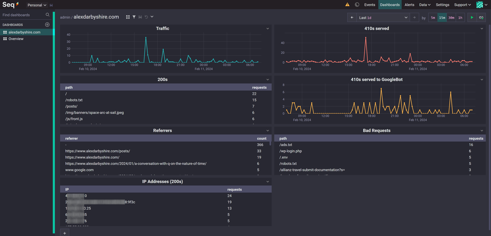


## Tech Stack
- **Ubuntu Linux** 22.04
- **K3s (Kubernetes)** 1.28.5
- **Fluent Bit** 2.2.2
- **Seq** 2024.1
- **Helm** 3.14.0
- **Nginx** 1.25.3


## Bring Your Own
* **Host running Ubuntu Linux**
* **Kubernetes**
* **Helm**
* **Nginx**
* **Email account with SMTP**
  * To send alerts


## Steps

### Setup and Install Seq with Helm

#### Configure Seq's Helm Values File

Add contents to file `deploy/helm/seq-values.yaml`
```yaml
# https://github.com/datalust/helm.datalust.co/blob/main/charts/seq/values.yaml
# Accept events in the GELF format and forward them to Seq
gelf:
  enabled: true

## Configure probe values
livenessProbe:
  enabled: true
  failureThreshold: 3
  initialDelaySeconds: 0
  periodSeconds: 10
  successThreshold: 1
  timeoutSeconds: 1

readinessProbe:
  enabled: true
  failureThreshold: 3
  initialDelaySeconds: 0
  periodSeconds: 10
  successThreshold: 1
  timeoutSeconds: 1

startupProbe:
  enabled: true
  failureThreshold: 30
  periodSeconds: 10
```
By default, Seq will provision a 8GB PersistentVolumeClaim using the default provider for storing log data. 

See their [values.yaml example file](https://github.com/datalust/helm.datalust.co/blob/main/charts/seq/values.yaml) for further details.

#### Define a Service for Seq
To allow us to access Seq's UI via an exposed port on the node.

Add contents to file `deploy/seq-service.yaml`
```yaml
apiVersion: v1
kind: Service
metadata:
  labels:
    app: seq-service
  name: seq
spec:
  ports:
  - name: seq-ui
    port: 8000
    targetPort: 80
  selector:
    app: seq
  type: LoadBalancer
```

#### Install Seq using Helm
```bash
helm repo add datalust https://helm.datalust.co 
helm repo update
helm install --values deploy/helm/seq-values.yaml my-seq datalust/seq
```

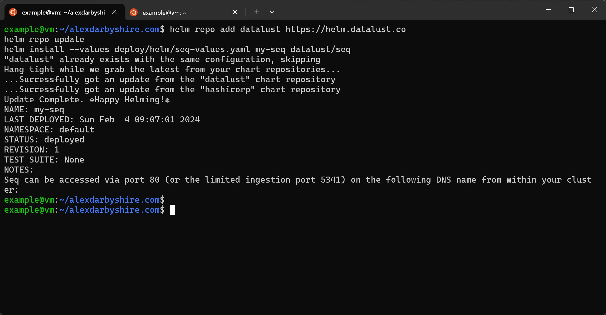

#### Add Seq Kubernetes Service
```bash
kubectl apply -f deploy/seq-service.yaml
```


### Setup and Install Fluent Bit as DaemonSet with Helm

#### Configure Fluent Bit's Helm Values File
Add contents to file `deploy/helm/fluent-bit-values.yaml`

[See contents in GitHub](https://github.com/alexdarbyshire/alexdarbyshire.com/blob/d3304b50f4cad2fff15066aad6a169b3c5e619d3/deploy/helm/fluent-bit-values.yaml) 

Notably, we configure GELF Output, a custom Nginx parser, add Seq's internal cluster hostname and disable `Keep_Log Off` wtihin the kubernetes filter.

##### How to set up a Fluent Bit Regex Nginx parser to capture IP for proxied requests
We create a custom parser to pick up the `http_x_forwarded_for` IP which Fluent Bit's baked Nginx parser does not include.

Note, this parser is included in the `fluent-bit-values.yaml` file linked above.

A custom parser is required in our setup as the `remote` IP will always be our Cloudflared pod which is forwarding requests received at the other end of the tunnel.

The parser uses a Regular Expression and looks like this:
```yaml
    [PARSER]
        Name   nginx-with-forwarded-for
        Format regex
        Regex ^(?<remote>[^ ]*) (?<host>[^ ]*) (?<user>[^ ]*) \[(?<time>[^\]]*)\] "(?<method>\S+)(?: +(?<path>[^\"]*?)(?: +\S*)?)?" (?<code>[^ ]*) (?<size>[^ ]*)(?: "(?<referer>[^\"]*)" "(?<agent>[^\"]*)") "(?<http_x_forwarded_for>[^ ]*)"$
        Time_Key time
        Time_Format %d/%b/%Y:%H:%M:%S %z
```

Were we not using Helm to deploy, it would be added to a Kubernetes ConfigMap (which Helm does under the hood).

The parser relies on Nginx using its default 'out-of-the-box' log format which is defined within one of the Nginx image's internal conf files, `/etc/nginx/nginx.conf`. Here is an excerpt for reference:
```nginx configuration
    log_format  main  '$remote_addr - $remote_user [$time_local] "$request" '
                      '$status $body_bytes_sent "$http_referer" '
                      '"$http_user_agent" "$http_x_forwarded_for"';
```

This could be approached a different way by configuring Nginx to log in structured manner in the first place by outputting JSON. This would reduce compute requirements in terms of Fluent Bit not needing to apply Regex.

#### Install Fluent Bit using Helm
```bash
helm repo add fluent https://fluent.github.io/helm-charts
helm upgrade --install --values deploy/helm/fluent-bit-values.yaml fluent-bit fluent/fluent-bit
```

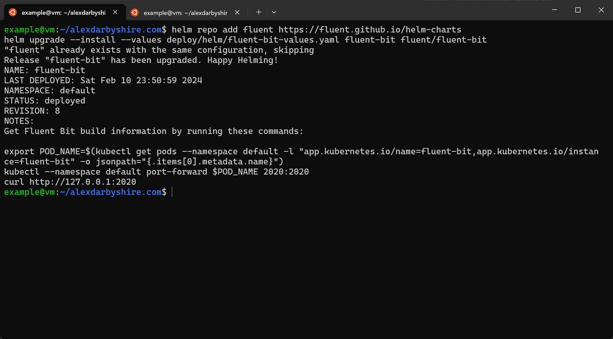

*Screenshot above shows output when Fluent Bit was already installed, it is very similar to the fresh install's output and the commands used remain the same*

#### Update Nginx Deployment Manifest to use Custom Fluent Bit Parser
To do this, we add an annotation to our Nginx's deployments pod template which is in `deploy/hugo-cloudflared.yaml`

```yaml {lineNos=inline,hl_lines=["16-17"],linenostart=73}
apiVersion: apps/v1
kind: Deployment
metadata:
  labels:
    app: nginx-hugo
  name: nginx-hugo-deployment
spec:
  replicas: 1
  selector:
    matchLabels:
      app: nginx-hugo
  template:
    metadata:
      labels:
        app: nginx-hugo
      annotations:
        fluentbit.io/parser: nginx-with-forwarded-for
    spec:
      containers:
      - image: localhost:5000/alexdarbyshire-site:latest
        name: nginx-hugo
        ports:
          - containerPort: 80
      restartPolicy: Always
```

#### Apply Changes to Nginx Deployment
```bash
kubectl apply -f deploy/hugo-cloudflared.yaml
```
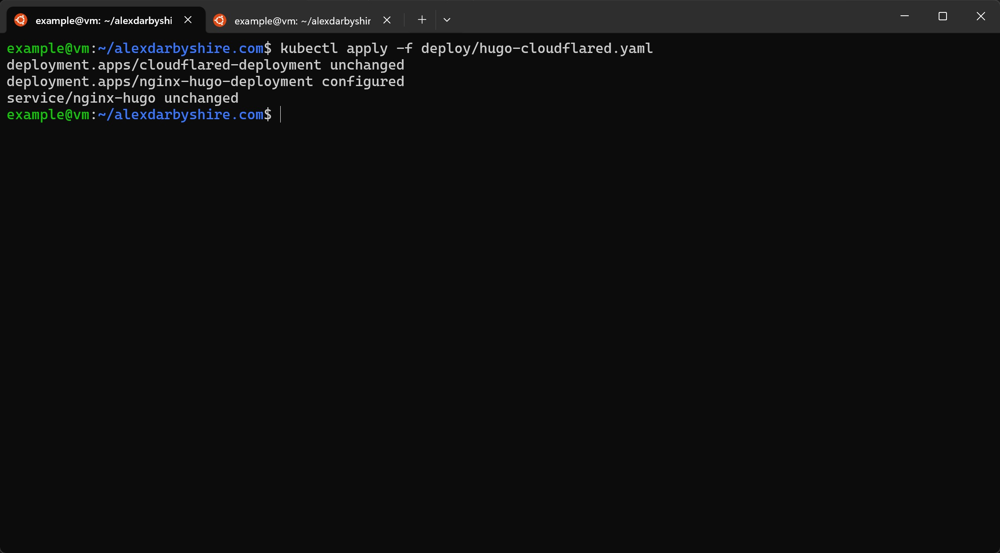

### Add Dashboard for Nginx to Seq

#### Add New Dashboard
Click the little plus with circle around it symbol.
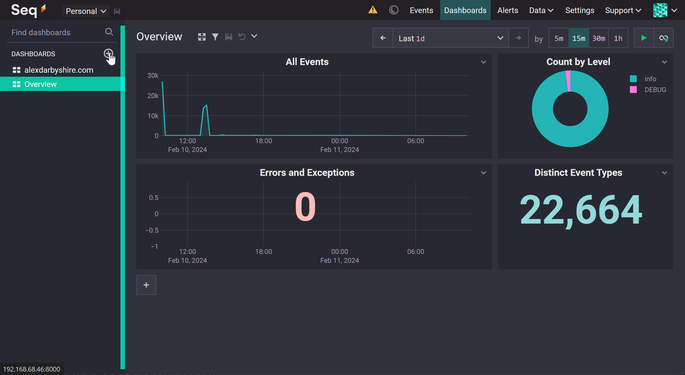

#### Create a Graph of Total Nginx log events
Click the plus to add a new visualisation, click `query` and then add a where clause `kubernetes_container_name = 'nginx-hugo'`, add a title e.g. `Total Nginx Log Events`.

Then click the save icon (little digital floppy disk looking thing to the left of the filter icon).
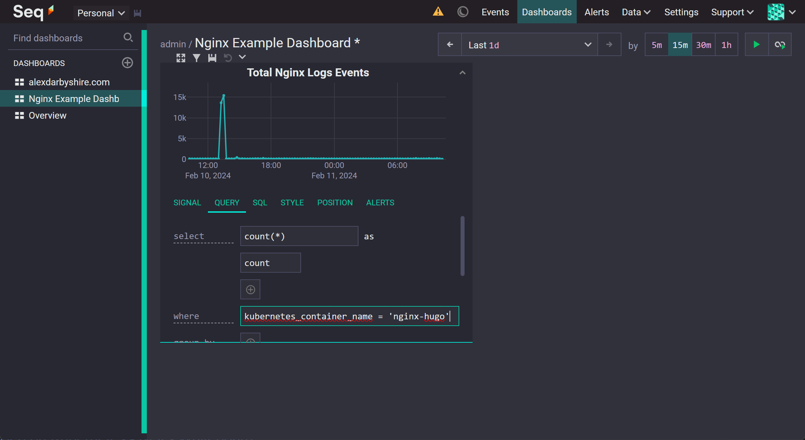
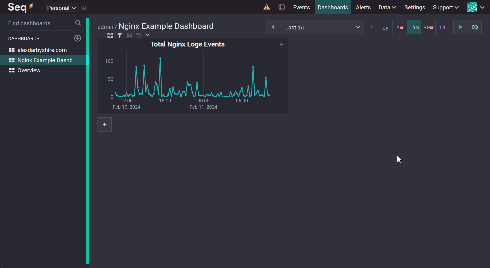

#### Other Dashboard Query Examples
Here we will run through the queries used to create these visualisations in this dashboard using Seq's query language.
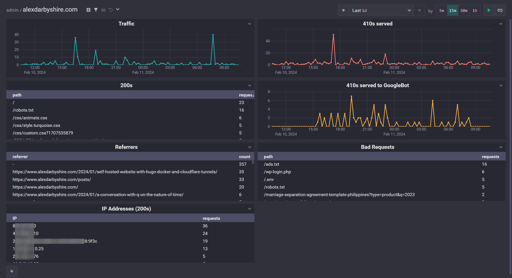
*Note, in typical circumstances the 410s (Gone) here would be 404s (Not Found). Something funky happened to my domain while it was dormant, possibly the Namecheap hosting IP I previously used was re-assigned, and GoogleBot indexed ~4000 spammy links. For a little while I am returning 410s for every bad link requested.* 

##### Traffic
**Query** 

select `count(*)`
as `count`
where `kubernetes_container_name = 'nginx-hugo' and http_x_forwarded_for <> 'YOUR-OWN-IP-HERE' and code <> '410'`

##### 200s
HTTP responses with status code 200 aggregated by path.

**Query**

select `count(*)` as
`requests`
where `kubernetes_container_name = 'nginx-hugo' and http_x_forwarded_for <> 'YOUR-OWN-IP-HERE' and code = '200'`

**Style**

Type `Table`

##### Referrers
Count of HTTP Referrer aggregated by referrer. 

**Query**

select `count(referer)`
as `count`
where `kubernetes_container_name = 'nginx-hugo' and http_x_forwarded_for <> 'YOUR-OWN-IP-HERE'`
group by `referer as referrer`
order by `count DESC`
limit `100`

**Style**

Type `Table`

##### IP Addresses (200s)

Count of 200 requests aggregated by IP address.

**Query**

select `count(http_x_forwarded_for)` 
as `requests`
where `kubernetes_container_name = 'nginx-hugo' and http_x_forwarded_for <> 'YOUR-OWN-IP-HERE' and code = '200'`
group by `http_x_forwarded_for as IP`
order by `requests DESC`
limit `100`

**Style**

Type `Table`

##### 410s served
Count of responses with HTTP 410 status code.

**Query**

select `count(*)`
as `count`
where `kubernetes_container_name = 'nginx-hugo' and http_x_forwarded_for <> 'YOUR_OWN_IP_HERE' and code = '410'`

**Style**

Palette `Red`

##### 410s served to GoogleBot
Count of responses to GoogleBot with HTTP 410 Status code.

**Query**

select `count(*)`
as `count`
where `kubernetes_container_name = 'nginx-hugo' and http_x_forwarded_for <> 'YOUR_OWN_IP_HERE' and code = '410' and agent like '%Googlebot%'`

**Style**

Palette `Orange-purple`


##### Bad Requests
Count of responses with status code other than 200 aggregated by requested path.

**Query**

select `count(*)` 
as `requests`
where `kubernetes_container_name = 'nginx-hugo' and http_x_forwarded_for <> 'YOUR_OWN_IP_HERE' and code <> '200'`
group by `path`
order by `requests DESC`
limit `100`

**Style**
Type `Table`

### Add Alerts to Seq

#### Add the Mail App to Seq
Click `Settings`, then `Apps`, then `Install From Nuget`.
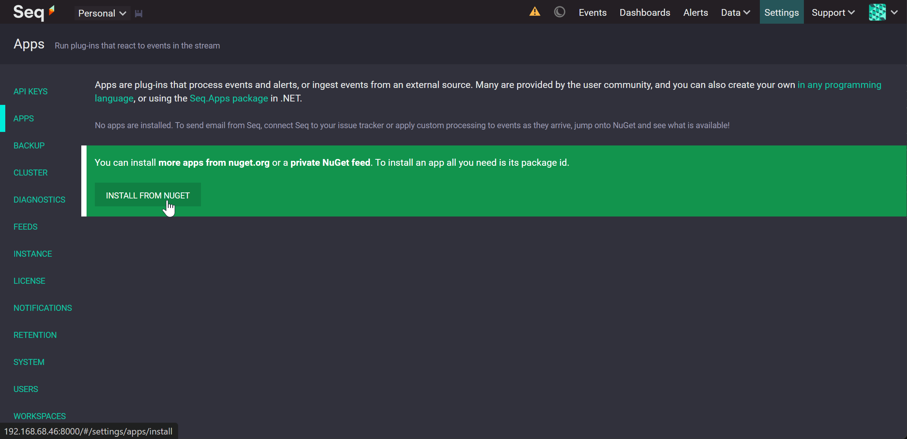

Enter Package id `Seq.App.Email` and click Install.
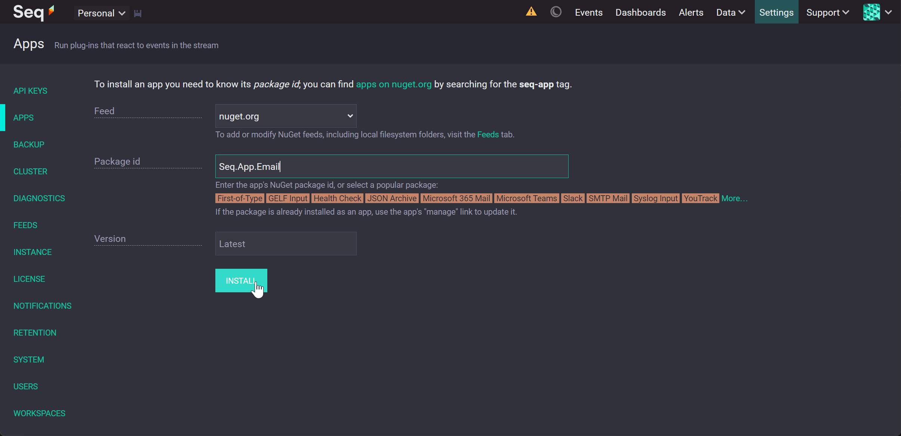

#### Add an Instance of the Mail App and Configure it

Click `Add Instance` for the newly installed app.
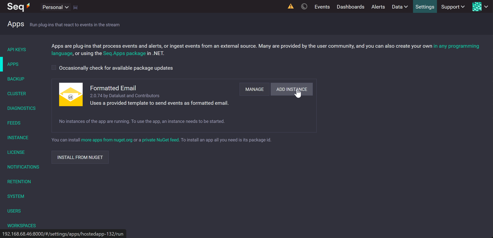

Configure the instance with the SMTP email account details.
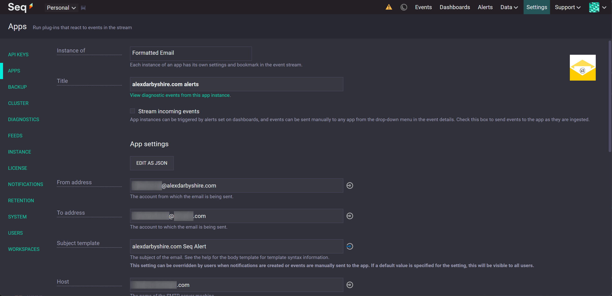
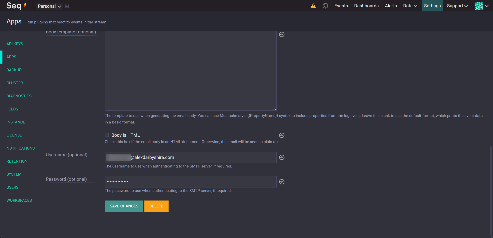


#### Add an Alert
Add an alert for a query, in this example the alert is sent when there is more than 500 requests responded to with HTTP status code 200 within a 15-minute period.
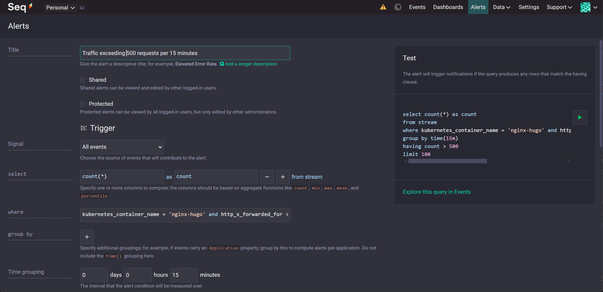
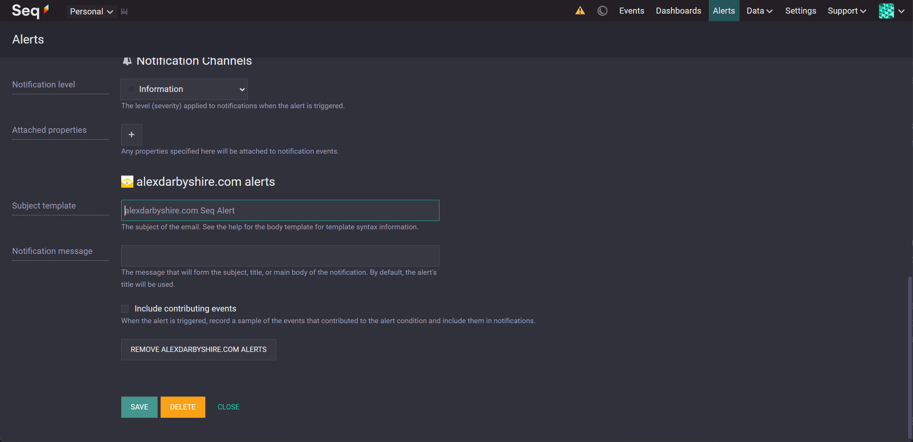

#### Success
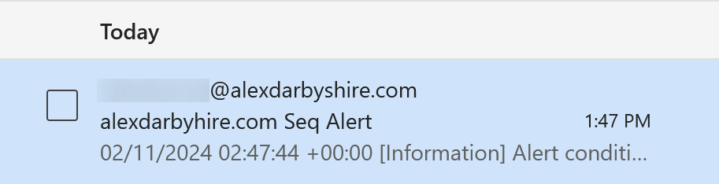

## Done