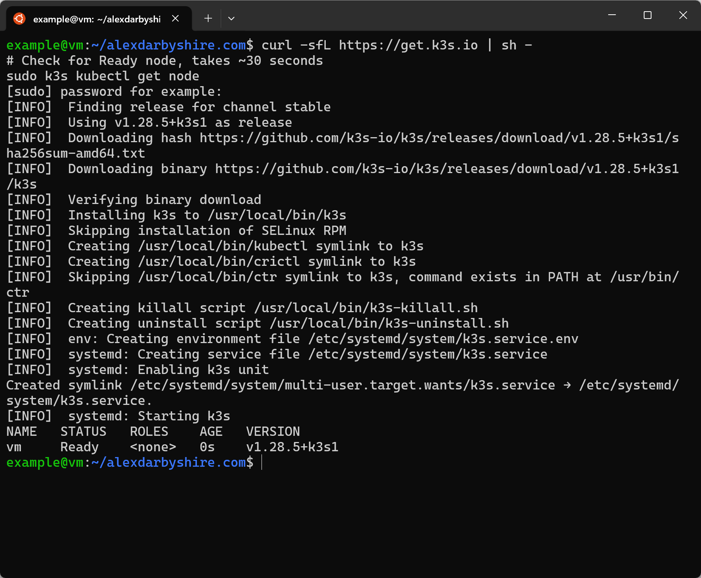
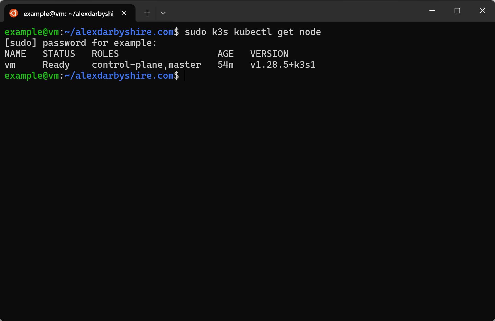
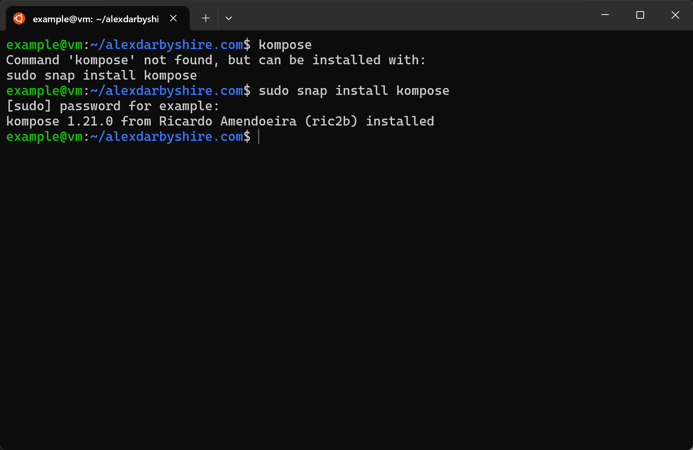
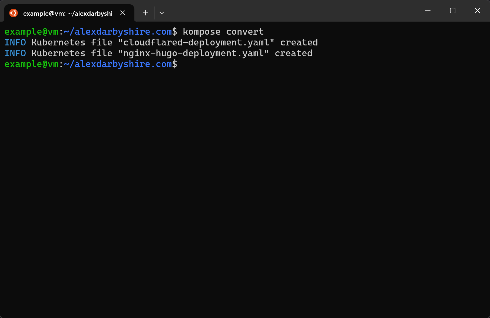
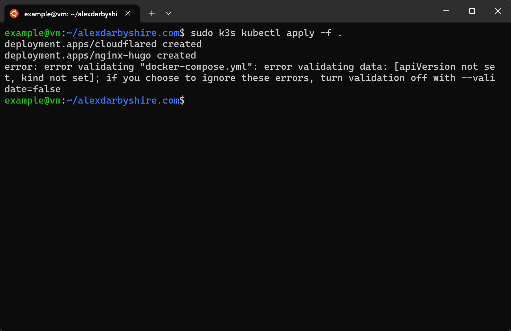
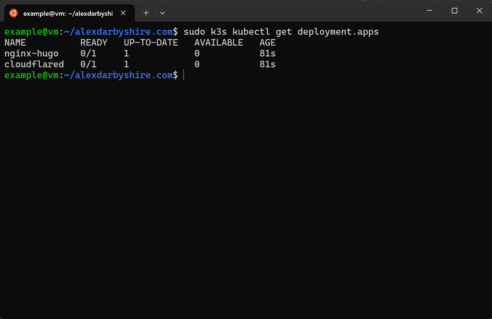
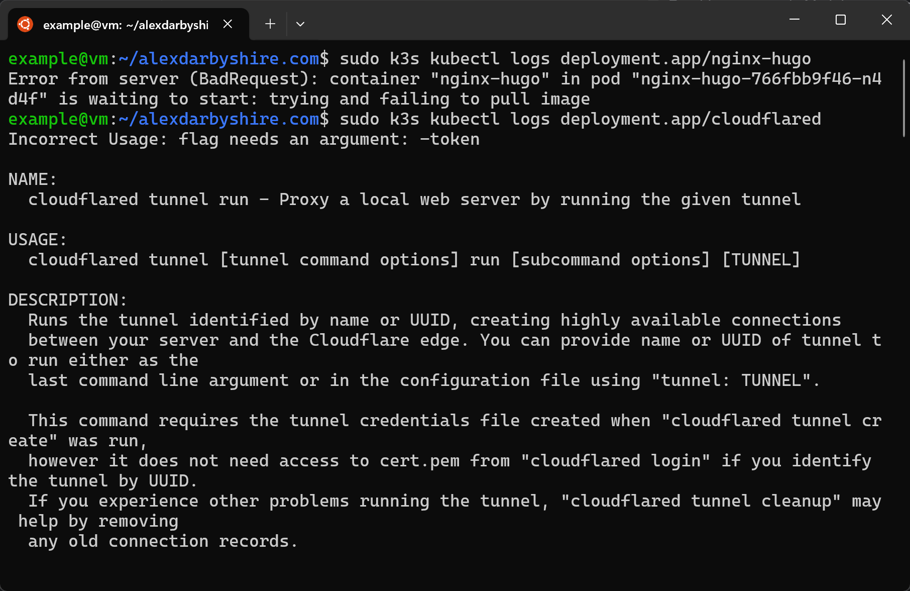
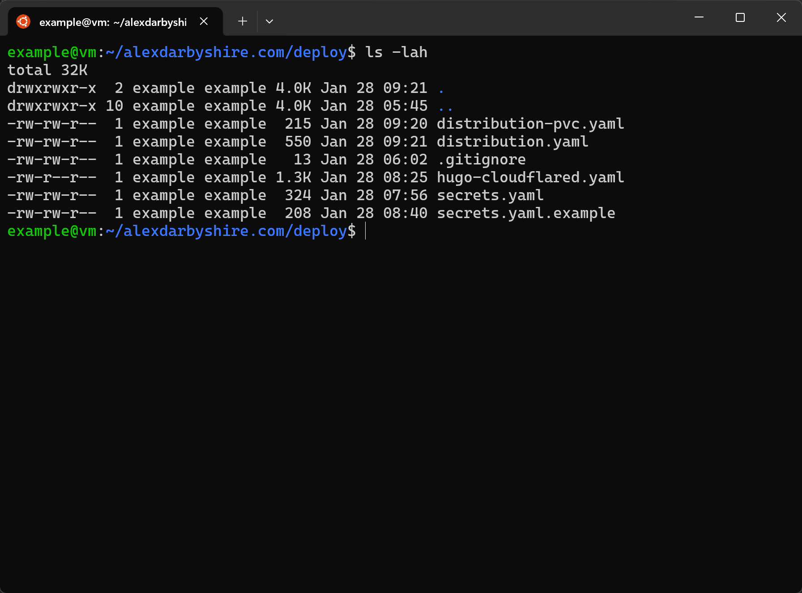
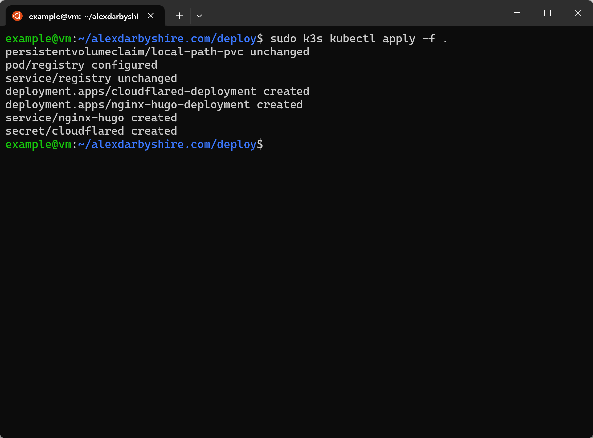
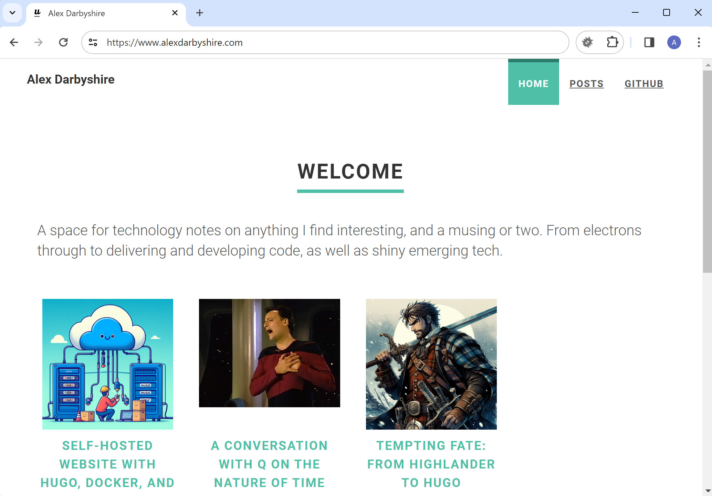

In this post, we will look at migrating Docker Compose run services to Kubernetes using a lightweight version called K3s. 

K3s provides an approachable way to experience Kubernetes. It is quick to spin up and takes care of a lot of boilerplate, which suits a test environment. We can work our way up to full Kubernetes (K8s) in the future.

We will continue using this site as an example and build upon the [previous post]( "Self-Hosted Website with Hugo, Docker, and Cloudflare Tunnels") which got our [GitHub repo to here.](https://github.com/alexdarbyshire/alexdarbyshire.com/tree/b468af84c2b2473776549cbba7d3238541556ce2)

## What is Kubernetes and where does it fit with Docker?
- **Kubernetes, OpenShift, Docker Swarm** Container orchestration tools that automate the deployment, scaling, and management of containerised applications across multiple nodes (computers).
- **Docker Compose** A tool for managing multi-container applications on a single node or within a swarm.
- **Docker** A tool for building and running containers using container images stored in registries.

Kubernetes allows containers to be scaled for huge audiences and to be scaled back down when the need reduces. Think Netflix at 8pm, Amazon on Black Friday, and Google serving varying numbers of users at a given time of day.

Google should get a special mention having developed Kubernetes and open-sourced it in the first place. 

Note, Docker Swarm is included the above for historical reasons, its usage is waning. 

The major cloud service providers offer their own abstracted versions of Kubernetes. I am learning CLI based Kubernetes as I find it is usually helpful to understand what is going on beneath the hood with complex systems.

## Example
> TODO: Insert Example Link once
 
## Tech stack
- **K3s**
- **Ubuntu Linux**
- **Docker**
- **Kompose** - open-source tool for converting Docker Compose definitions to Kubernetes resources
- **Distribution** - private container registry

## Bring Your Own
- **Host running Ubuntu Linux**
  - e.g. VirtualBox VM, Bare metal host, Virtual Private Server (VPS)  
- **Docker** -- installed on host
    - [Install Docker](https://docs.docker.com/engine/install/ubuntu/)
    - [Install Docker with convenience script](https://docs.docker.com/engine/install/ubuntu/#install-using-the-convenience-script)

## Steps
### Install K3s and Kompose
[K3s Quick Start for reference](https://docs.k3s.io/quick-start)
#### Install K3s 

```
curl -sfL https://get.k3s.io | sh -
```


#### Confirm K3s Node Creation
```
sudo k3s kubectl get node
```

We can see it is ready by the roles `control-plane` and `master`.

#### Install Kompose
```
sudo snap install kompose
```


### Convert, Configure, and Run
#### Convert with Kompose
```
kompose convert
```

Hmm... That was easy, almost too easy. Let's be gung-ho, not check what the output looks like and see if the new resource definitions work.

Ask kubectl to apply the configuration files in the current folder.
```
sudo k3s kubectl apply .
```


It threw an error for the docker-compose.yml file because it doesn't know how to parse it. Fair.

Check the status of the resources
```
sudo k3s kubectl get deployment.apps
```


Ok, neither of our resources are available. Time to hit the logs.

```
sudo k3s kubectl logs deployment.app/hugo-nginx
sudo k3s kubectl logs deployment.app/cloudflared
```


In the above output we discover:
1. The hugo-nginx image is not available to K3s. In the last post we built it in Docker's internal local image repository which K3s doesn't talk to.
2. Cloudflared is missing its token

```
cat cloudflared-deployment.yaml
```


We need to: 
- spin up a private registry for images and push our images (or push them to someone else's),
- pass our token into K3s using secrets, and
- add a Kubernetes service manifest for nginx-hugo. Kompose did not have sufficient info to tell that cloudflared needed to connect to nginx-hugo.

#### Create a Private Registry
We are creating the registry using K3s. It would be easier in Docker, and Docker may well be the better tool for the task, but that won't help us learn K3s.
First we will create a subdirectory called deploy for housing our K3s manifests.
```
mkdir deploy
cd deploy
```

Then, we add a file named `distribution.yaml` with the following contents. 
```
apiVersion: v1
kind: Pod
metadata:
  labels:
    app: registry
  name: registry
spec:
  containers:
  - image: registry:2
    name: registry
    volumeMounts:
    - name: volv
      mountPath: /var/lib/registry
    ports:
     - containerPort: 5000
  volumes:
    - name: volv
      persistentVolumeClaim:
        claimName: local-path-pvc

---

apiVersion: v1
kind: Service
metadata:
  labels:
    app: registry
  name: registry
spec:
  ports:
  - name: "5000"
    port: 5000
    targetPort: 5000
  selector:
    app: registry
  type: LoadBalancer
```

Add another file called `distribution-pvc.yaml` with contents:
```
apiVersion: v1
kind: PersistentVolumeClaim
metadata:
  name: local-path-pvc
  namespace: default
spec:
  accessModes:
    - ReadWriteOnce
  storageClassName: local-path
  resources:
    requests:
      storage: 4Gi
```

This files define two resources for running a private registry, and a local storage volume. Local storage isn't aligned with the Kubernetes approach, however it will suit our test usage. 


Note, this setup does not include authentication so should not be exposed.

#### Bring up the registry
```
sudo k3s kubectl apply -f deployment-pvc.yml
sudo k3s kubectl apply -f deployment.yaml
```

#### Re-tag and then push the images to the registry using Docker
```
docker image tag homelab/alexdarbyshire-site:3 localhost:5000/alexdarbyshire-site:3
docker image tag localhost:5000/alexdarbyshire-site:3 localhost:5000/alexdarbyshire-site:3

docker push localhost:5000/alexdarbyshire-site:3
docker push localhost:5000/alexdarbyshire-site:latest
```

#### Using secrets to pass our Cloudflare Tunnel token 
First, encode your token to base64 and make note of it. 
```
echo "insert_token_here# | base64 -w 0 
```
Base64 is not encryption, it is encoding type and is not secure, we should treat our base64 token in the same way we treat our plaintext token.

Create a file called `secrets.yaml.example` with the following contents:
```
apiVersion: v1
kind: Secret
metadata:
  name: cloudflared
data:
  token: insert_token_encoded_as_base64_here 
```

Make a copy and add the new file to `.gitignore` to exclude it from the git repo
```
cp secrets.yaml.example secrets.yaml
echo "secrets.yaml" >> .gitignore
```

Edit secrets.yaml and add the base64 encoded token into it

#### Add the Kubernetes manifest for cloudflared-hugo
The output of the Kompose command needed a fair bit of work. It gives us an idea of its limitations. 

We will not use the files it created, below is a cleaned up version with the missing requirements added (service, port mappings, and updated image path).

Create a file called `cloudflared-hugo.yaml` with the following contents:
```
apiVersion: apps/v1
kind: Deployment
metadata:
  labels:
    app: cloudflared
  name: cloudflared-deployment
spec:
  replicas: 1
  selector:
    matchLabels:
      app: cloudflared
  template:
    metadata:
      labels:
        app: cloudflared
    spec:
      containers:
      - args:
        - tunnel
        - --no-autoupdate
        - run
        - tunnel
        env:
          - name: TUNNEL_TOKEN
            valueFrom:
              secretKeyRef:
                name: cloudflared
                key: token
        image: cloudflare/cloudflared:latest
        name: cloudflared
      restartPolicy: Always

---

apiVersion: apps/v1
kind: Deployment
metadata:
  labels:
    app: nginx-hugo
  name: nginx-hugo-deployment
spec:
  replicas: 1
  selector:
    matchLabels:
      app: nginx-hugo
  template:
    metadata:
      labels:
        app: nginx-hugo
    spec:
      containers:
      - image: localhost:5000/alexdarbyshire-site:latest
        name: nginx-hugo
        ports:
          - containerPort: 80
      restartPolicy: Always

---

apiVersion: v1
kind: Service
metadata:
  name: nginx-hugo
spec:
  selector:
    app: nginx-hugo
  ports:
    - protocol: TCP
      port: 80
      targetPort: 80
---
```

The deploy folder should now look like this:


#### Apply all the manifests
Run the following from the `deploy` directory
```
sudo k3s kubectl apply -f .
```

That should do the trick.

#### Down the superseded docker compose stack
```
docker compose down
```

#### Confirm K3s is working
Success.


### Clean up 
We have some files we no longer need. 

```
cd ~/alexdarbyshire.com
docker compose down -d
rm .env .env.example 
rm docker-compose.yml
rm nginx-hugo-deployment.yaml cloudflared-deployment.yaml
```

## Done
Now we can start dreaming about the next improvement.
