Let us walk through setting up an Actions Runner Controller (ARC) for GitHub in a Kubernetes cluster. This will enable running continuous integration and continuous deployment (CI/CD) pipelines using GitHub Actions on our infrastructure, or on cloud based Kubernetes.

First, we'll introduce a bit of the terminology:

- **Runner** a container which runs code in response to a trigger. They may be used to test, build and deploy code, as well as far more creative use-cases.

- **Workflow** one or more jobs.

- **ARC** a Kubernetes implementation of GitHub runners built by the open-source community. It allows scaling to workload requirements.

Self-hosted GitHub Runners function by polling GitHub for new workflows within a scope. Workflows can be triggered by GitHub events such as pushing code, merging code, publishing a version, or manually via GitHub's Web UI. Workflow definitions are YAML formatted and live in `.github/workflows/` within a repo. 

Using this site as our continuing example, ARC will be implemented to build our website image, deploy the image to a registry and patch our Kubernetes deployment. In practice, we `git push` to `main` branch and the website will be updated automatically.

In the last three posts the deployment process has been via `docker build`, `docker push` and some `kubectl` commands.

We will be continuing on from the previous post and [the resulting repo](https://github.com/alexdarbyshire/alexdarbyshire.com/tree/5f2c58ea37fb9a1cfc9c6e1eddb0c5d98e422b0d). 
## Example

[Checkout the end result in GitHub](https://github.com/alexdarbyshire/alexdarbyshire.com/tree/0c8a34f289dd37da93c237be24cc82c3445b2dd2)

## References
[ARC Documentation](https://docs.github.com/en/actions/hosting-your-own-runners/managing-self-hosted-runners-with-actions-runner-controller/about-actions-runner-controller)


## Tech Stack
- ARC
- K3s
- Ubuntu Linux
- Helm


## Bring Your Own
- **Host running Ubuntu Linux**
    - e.g. VirtualBox VM, Bare metal host, Virtual Private Server (VPS), WSL2
- **K3s installed on host**
- **Helm**

## Steps

### Setup GitHub
First, a note on security. GitHub actions can be used to expose secrets and other sensitive information. A repo contributor with push permissions can insert a workflow definition. The risks when self-hosting are higher than when using GitHub's platform as information about our infrastructure may be exposed as well.

This is particularly relevant for adding runners at Github's organisation or enterprise levels.

[See GitHub documentation for details](https://docs.github.com/en/repositories/managing-your-repositorys-settings-and-features/enabling-features-for-your-repository/managing-github-actions-settings-for-a-repository).

#### Securing Public Repos
Adding runners to public repos presents an attack vector.

A bad actor may fork a public repo, add a workflow definition containing a merge request trigger, then submit a pull request to the original repo resulting in the rogue workflow being executed on a runner of the original repo.

To mitigate this we: 
##### Set the repo to require approval for workflows from outside collaborators

Click `Settings` in the GitHub repo.
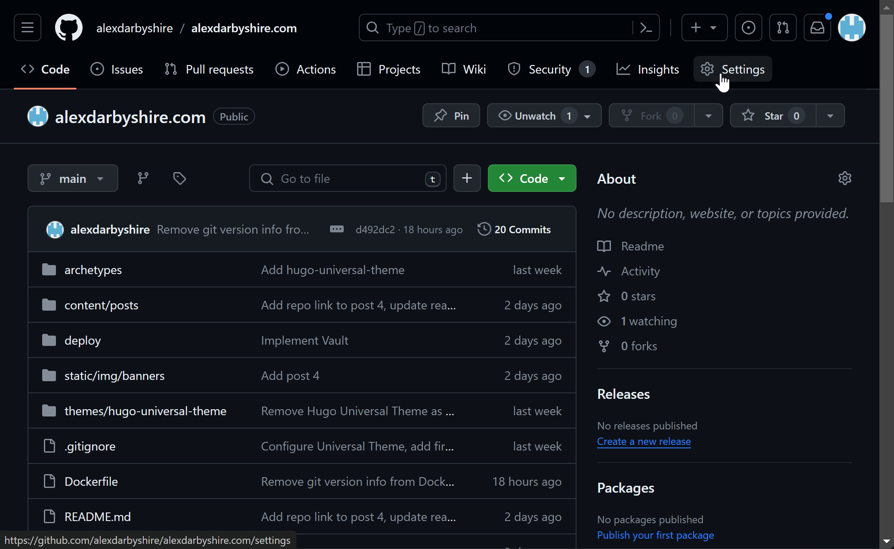

Click `Actions` then `General`.
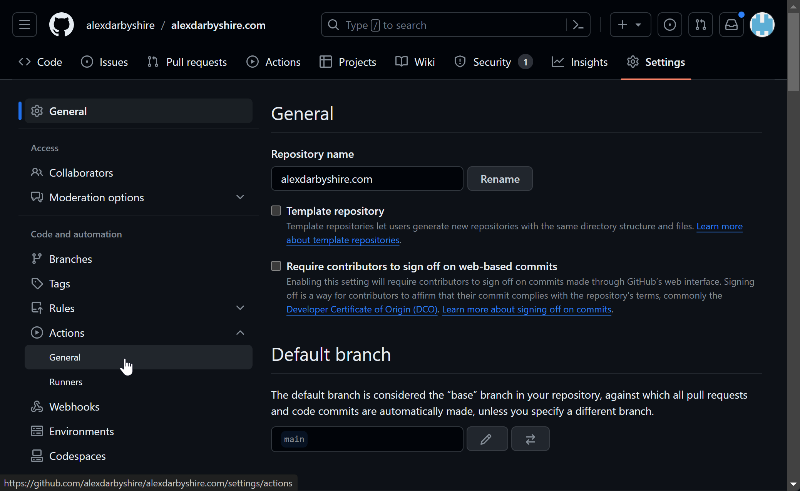

Select `Require approval for all outsidde collaborators` and save.
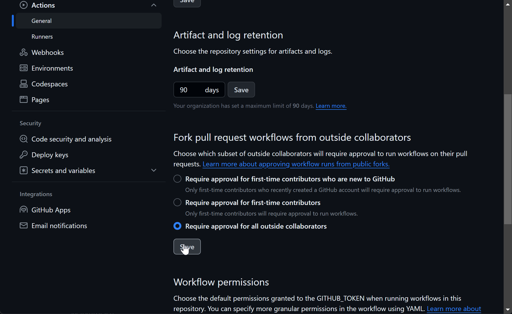

#### Setting up a GitHub Token
Create a personal access token (classic), see GitHub's [Manage your Personal Access Token documentation](https://docs.github.com/en/authentication/keeping-your-account-and-data-secure/creating-a-personal-access-token#creating-a-personal-access-token-classic). 

Add `repo` permissions for a repository based runner.
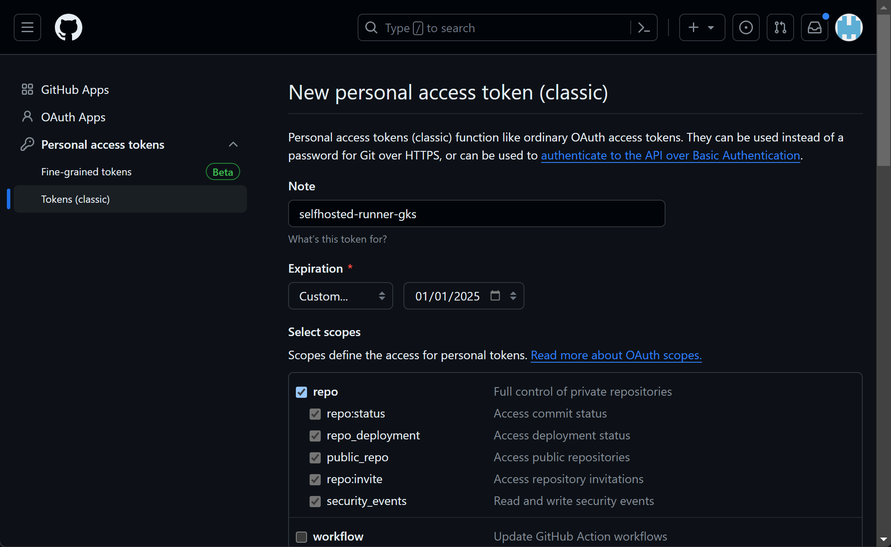

Or if for an organisation, add `admin:org` permissions.

Note the token, we will add it as a secret in a few steps.

### Install and Configure ARC
For the sake of reduced complexity, we have done everything in Kubernetes default namespace. In non-test environments, namespaces should be used to isolate resources in accordance with the principle of least privilege.

#### Add Kubernetes Service Account
This step is relevant to use-cases requiring management of Kubernetes through GitHub actions, where the Kubernetes cluster has no public facing API.


In our case, it enables us to patch our deployment from the GitHub workflow. Without defining and attaching a specific service account, the default runner service account has zero permissions.

Were this production we might abstract this away with an API service or use additional tools to prevent the need for these permissions being granted to runners.

Create a file `deploy/rollout-auth-service-account.yaml` with contents:
```yaml
apiVersion: v1
kind: ServiceAccount
metadata:
  name: rollout-auth
  namespace: default
---
kind: Role
apiVersion: rbac.authorization.k8s.io/v1
metadata:
  namespace: default
  name: restarter
rules:
  - apiGroups: ["apps", "deployments"]
    resources: ["deployments", "replicasets", "pods"]
    verbs: ["get", "patch"]
---
apiVersion: rbac.authorization.k8s.io/v1
kind: RoleBinding
metadata:
  name: rollout-binding
  namespace: default
subjects:
- kind: ServiceAccount
  name: rollout-auth
roleRef:
  kind: Role
  name: restarter
  apiGroup: rbac.authorization.k8s.io
```


#### Add ARC Helm Values
This is required to allow us to use docker-in-docker, and to attach the service account from the previous setup. With the benefit of hindsight, would be better to use `kaniko` to build images thereby avoiding exposing the docker socket and its privileges to the runner.

Add file `deploy/helm/arc-runner-values.yaml` with contents:

```yaml
## githubConfigUrl is the GitHub url for where you want to configure runners
## ex: https://github.com/myorg/myrepo or https://github.com/myorg (personal accounts appear to be limited to repos level only)
githubConfigUrl: "https://github.com/alexdarbyshire/alexdarbyshire.com"

## githubConfigSecret is the k8s secrets to use when auth with GitHub API.
githubConfigSecret: github-alexdarbyshire-com-pat
##   For a pre-defined secret using GitHub PAT, the secret needs to be created like this:
##   > kubectl create secret generic github-alexdarbyshire-com-pat --namespace=arc-runners --from-literal=github_token='ghp_your_pat'

## maxRunners is the max number of runners the autoscaling runner set will scale up to.
#maxRunners: 2

## template is the PodSpec for each runner Pod
## For reference: https://kubernetes.io/docs/reference/kubernetes-api/workload-resources/pod-v1/#PodSpec
template:
  spec:
     serviceAccountName: rollout-auth #Here we add our service account
     initContainers:
     - name: init-dind-externals
       image: ghcr.io/actions/actions-runner:latest
       command: ["cp", "-r", "-v", "/home/runner/externals/.", "/home/runner/tmpDir/"]
       volumeMounts:
         - name: dind-externals
           mountPath: /home/runner/tmpDir
     containers:
     - name: runner
       image: ghcr.io/actions/actions-runner:latest
       command: ["/home/runner/run.sh"]
       env:
         - name: DOCKER_HOST
           value: unix:///run/docker/docker.sock
       volumeMounts:
         - name: work
           mountPath: /home/runner/_work
         - name: dind-sock
           mountPath: /run/docker
           readOnly: true
     - name: dind
       image: docker:dind
       args:
         - dockerd
         - --host=unix:///run/docker/docker.sock
         - --group=$(DOCKER_GROUP_GID)
       env:
         - name: DOCKER_GROUP_GID
           value: "123"
       securityContext:
         privileged: true
       volumeMounts:
         - name: work
           mountPath: /home/runner/_work
         - name: dind-sock
           mountPath: /run/docker
         - name: dind-externals
           mountPath: /home/runner/externals
     volumes:
     - name: work
       emptyDir: {}
     - name: dind-sock
       emptyDir: {}
     - name: dind-externals
       emptyDir: {}
```
See [values.yaml](https://github.com/actions/actions-runner-controller/blob/master/charts/gha-runner-scale-set/values.yaml) for further configuration options.


#### Add GitHub Token to Kubernetes Secrets
```bash
kubectl create secret generic github-alexdarbyshire-com-pat --namespace="arc-runners" --from-literal=github_token='ghp_your_pat_here'
```
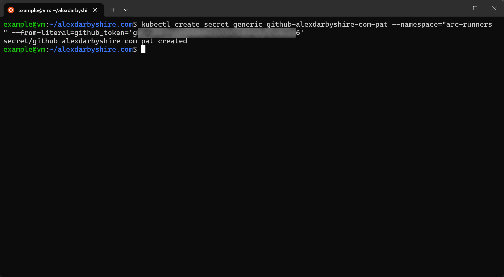
Note the controller looks for the secret in the `arc-runners` namespace with our configuration. 

#### Install ARC Charts

Install the ARC Controller with this command:
```bash
namespace=""
helm install arc \
    --namespace "${namespace}" \
    --create-namespace \
    oci://ghcr.io/actions/actions-runner-controller-charts/gha-runner-scale-set-controller
```
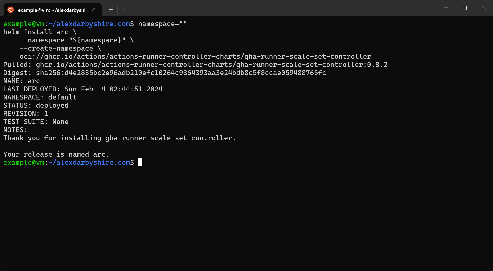

Then install the ARC Runner Set:
```bash
INSTALLATION_NAME="arc-runner-set"
NAMESPACE=""
helm install "${INSTALLATION_NAME}" \
--namespace "${NAMESPACE}" \
--create-namespace \
oci://ghcr.io/actions/actions-runner-controller-charts/gha-runner-scale-set \
--values deploy/helm/arc-runner-values.yaml
```
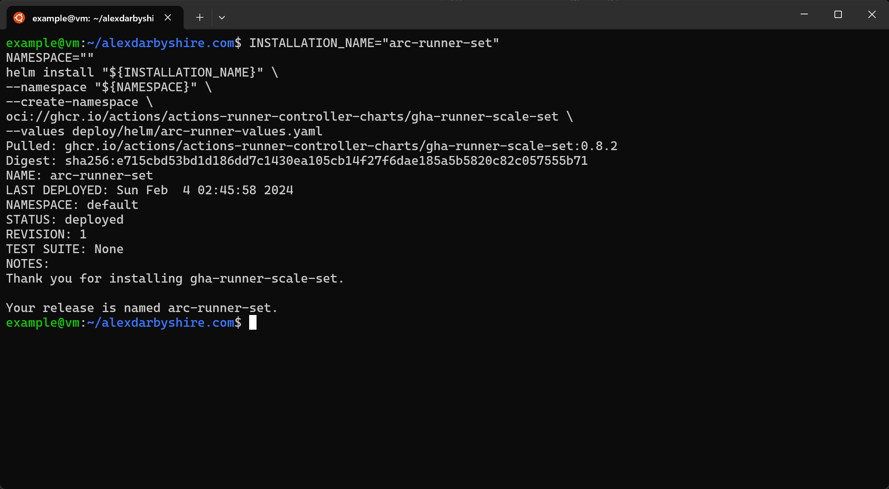
#### Check ARC Pods are up
```bash
kubectl get pods
```
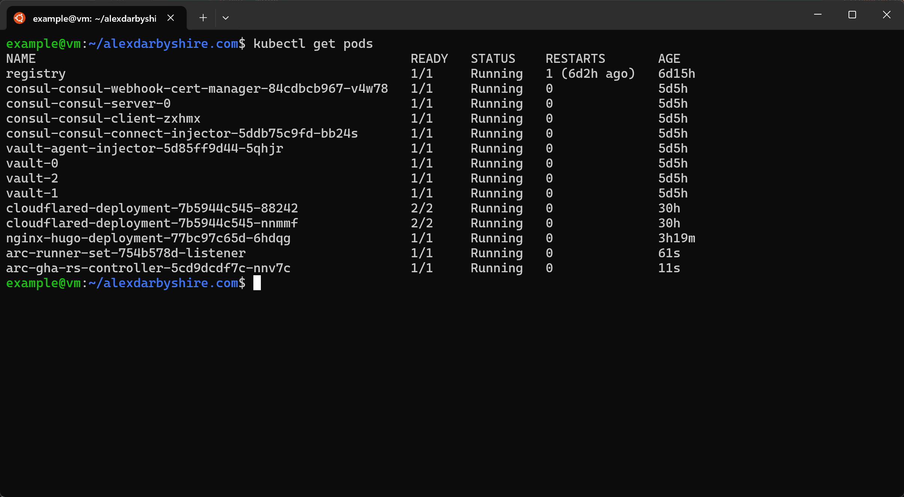

Not up? Check the ARC controller logs. `kubectl logs ...` where ... is the name of the controller pod. Note, if using namespaces and the controller doesn't have succificient permissions to the Kubernetes API there may not be logs events associated with the runner set not coming up (controller may not be able to 'see' the runner set).

### Define and Deploy the Workflow

Create a directory in the repo where GitHub reads workflow definitions from:
```bash
mkdir -p .github/workflows/
```
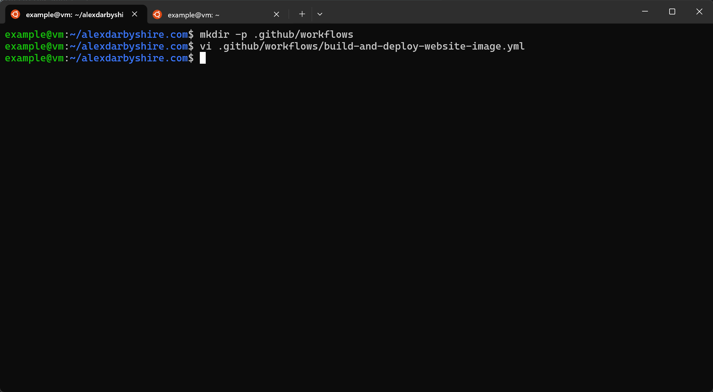

Create a file `.github/workflows/build-and-deploy-website-image.yml` with contents:
```yaml
name: Build-and-Deploy-Image
run-name: ${{ github.actor }} is updating alexdarbyshire.com
on:
  push:
    branches:
      - main
env:
  IMAGE_TAG: ${{ github.sha }}
  IMAGE_NAME: "alexdarbyshire-site"
  BASE_URL: "https://www.alexdarbyshire.com"

jobs:
  Build-and-Push:
    runs-on: arc-runner-set
    steps:
      - name: Check out repository code
        uses: actions/checkout@v4
        with:
          repository: 'alexdarbyshire/alexdarbyshire.com'

      - name: Set up QEMU
        uses: docker/setup-qemu-action@v3

      - name: Set up Docker Buildx
        uses: docker/setup-buildx-action@v3
        with:
          config-inline: |
            [registry."registry:5000"]
              http = true
              insecure = true

      - name: Build and push to local registry
        uses: docker/build-push-action@v5
        with:
          context: .
          build-args: |
            HUGO_ENV=production
            HUGO_BASEURL=${{ env.BASE_URL }}
          push: true
          tags: registry:5000/alexdarbyshire-site:${{ github.sha }},registry:5000/alexdarbyshire-site:latest

      - name: Inspect
        run: |
          docker buildx imagetools inspect registry:5000/$IMAGE_NAME:$IMAGE_TAG

  Patch-Deployment-Image:
    runs-on: arc-runner-set
    needs: Build-and-Push
    steps:
      - name: Install Kubectl
        env:
          KUBE_VERSION: "v1.29.1"
        run: |
          sudo apt update
          sudo apt install -yq openssl curl ca-certificates
          sudo curl -L https://storage.googleapis.com/kubernetes-release/release/$KUBE_VERSION/bin/linux/amd64/kubectl -o /usr/local/bin/kubectl
          sudo chmod +x /usr/local/bin/kubectl

      - name: Update kubernetes deployment to image
        run: |
          kubectl patch deployment nginx-hugo-deployment -p \
          '{"spec":{"template":{"spec":{"containers":[{"name":"nginx-hugo","image":"localhost:5000/alexdarbyshire-site:'$IMAGE_TAG'"}]}}}}'
```

This workflow is triggered on push (or merge end) to `main` branch.
The jobs within collectively:
- check out the code from the `main` branch of the repo,
- build our Dockerfile with the commit SHA as its tag,
- push the image to our local repository, and
- patch our deployment to use the newly built image.

#### Add, Commit, and Push the Code
First, check what we will be adding/staging with `git status`.

```bash
git add .
git commit -m 'Add ARC GitHub Runner and website deploy workflow'
git push
```
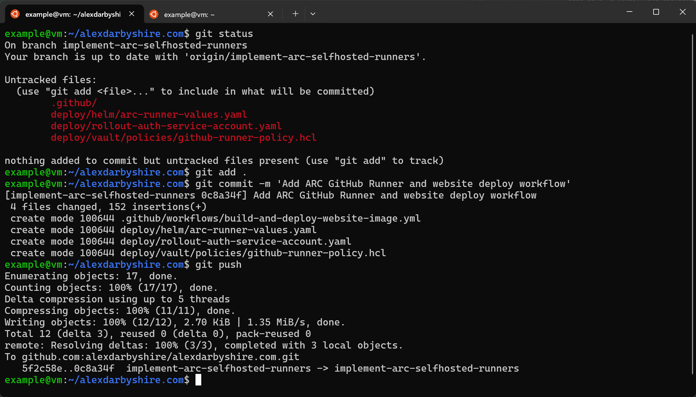
*Disregard the branch in this screenshot*

#### Confirm Workflow Execution
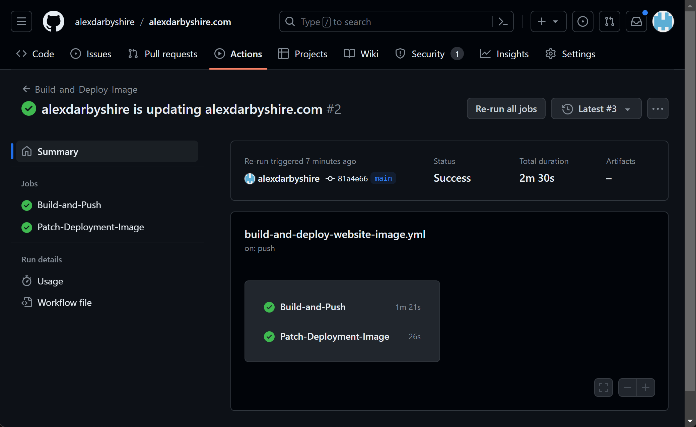
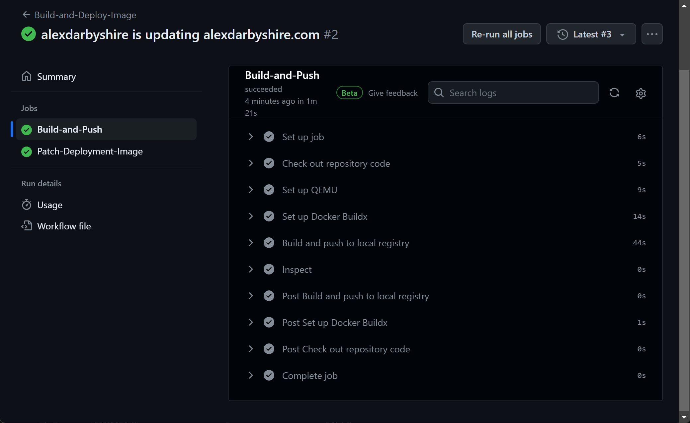
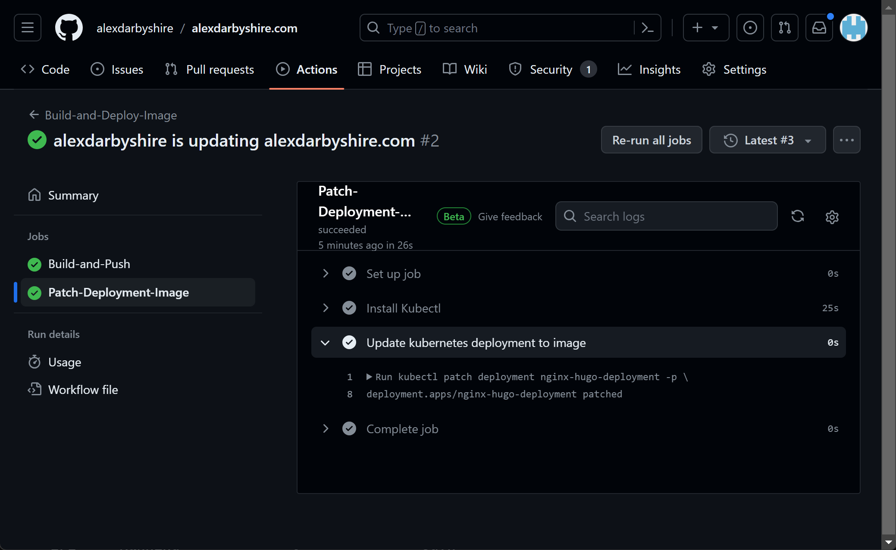
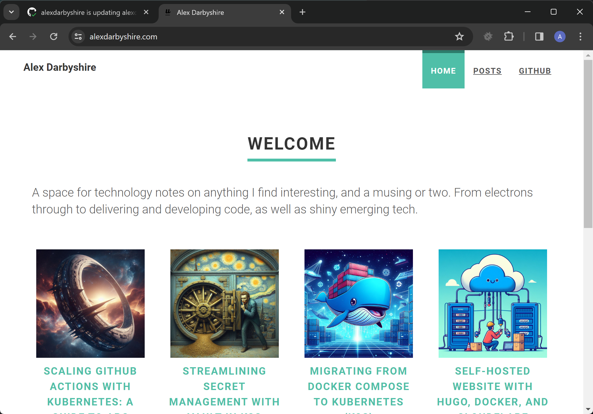
Success!


## Done
With GitHub Actions setup, perhaps it is time to turn our attention towards improving observability of Kubernetes resources.